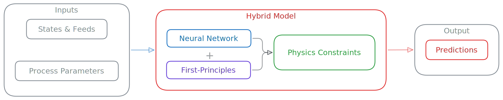
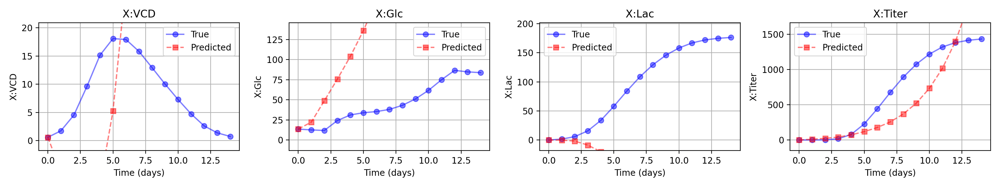

# Neural-Bio: Hybrid Modeling Framework for Bioreactor Optimization



A hybrid modeling framework combining neural networks with physics-based constraints for bioreactor process optimization and control.
- Neural network for reaction rate prediction
- First principle model for bioreactor dynamics
- Physics-informed constraints integration
- Adaptive weighted loss function

## Overview



🧬 Neural-Bio is a PyTorch-based framework that implements a hybrid modeling approach for bioprocess optimization. It combines deep learning with mechanistic models to predict and optimize bioreactor processes, incorporating both data-driven insights and physical constraints.


## Installation

```bash
# Clone the repository
git clone https://github.com/deepbiolab/neural-bio.git
cd neural-bio

# Create a virtual environment (optional but recommended)
python -m venv venv
source venv/bin/activate  # On Windows: venv\Scripts\activate

# Install dependencies
pip install -r requirements.txt
```

## Usage

### Training

```bash
python main.py --mode train
```

- Place training data files in the `dataset/train` folder
- Ensure data follows the required format (see Data Format section)
- Adjust configuration settings in `src/config/default_config.py` as needed
- Training and validation performance imgs are saved in the `logs/` directory

### Testing

```bash
python main.py --mode test
```

- Place test data files in the `dataset/test` folder
- Ensure data follows the required format (see Data Format section)
- Verify model checkpoint exists in `checkpoints/` directory
- Test performance is saved in the `logs/` directory

### Prediction

```bash
python main.py --mode predict
```

- Place input data files in the `dataset/predict` folder
- Ensure data follows the required format (see Data Format section)
- Verify model checkpoint exists in `checkpoints/` directory
- Prediction results are saved in the `results/` directory

## Project Structure

```
neural-bio/
├── src/
│   ├── config/          # Configuration settings
│   ├── data/            # Data processing and dataset classes
│   ├── models/          # Neural network and hybrid model implementations
│   ├── trainer          # Training utilities
│   ├── inference        # inference utilities
│   └── utils/           # Visualization and evaluation tools
├── dataset/             # Data directory (not included)
├── checkpoints/         # Model checkpoints
├── results/             # Prediction results
├── logs/                # Training logs
└── main.py              # Main script for training, prediction, and testing
```

## Configuration

The model behavior can be customized through the configuration file `src/config/default_config.py`. Key parameters include:

- Dataset parameters (time steps, variables, etc.)
- Model architecture (layers, dimensions)
- Training parameters (learning rate, batch size)
- Loss function weights
- Evaluation metrics

## Data Format

The framework expects two main data files in CSV format:

### OWU (Observation Wise Unit) Data
Time-series measurements of process variables for each experimental run.

```
run,time,VCD,Glc,Lac,Titer,Glc_feed
```

- `run`: Experiment run index
- `time`: Time point (days)
- State Variables:
  - `VCD`: Viable Cell Density (10⁶ cells/mL)
  - `Glc`: Glucose concentration (g/L)
  - `Lac`: Lactate concentration (g/L)
  - `Titer`: Product titer (g/L)
- Feeding Variables:
  - `Glc_feed`: Glucose feeding rate (g/L/day)

### DOE (Design of Experiments) Data
Experimental design parameters and initial conditions for each run.

```
run,feed_start,feed_end,Glc_feed_rate,Glc_0,VCD_0
```

- `run`: Experiment run index
- Feeding Schedule:
  - `feed_start`: Day to start feeding
  - `feed_end`: Day to stop feeding
  - `Glc_feed_rate`: Glucose feed concentration
- Initial Conditions:
  - `Glc_0`: Initial glucose concentration
  - `VCD_0`: Initial viable cell density

### Data Organization

```
dataset/
├── interpolation/
│   ├── train/
│   │   ├── owu.csv
│   │   └── owu_doe.csv
│   ├── test/
│   │   ├── owu.csv
│   │   └── owu_doe.csv
│   └── predict/
│       ├── owu.csv
│       └── owu_doe.csv
```

## Contributing

Contributions are welcome! Please feel free to submit a Pull Request.

## License

This project is licensed under the MIT License - see the [LICENSE](LICENSE) file for details.

## Citation

If you use this code in your research, please cite:

```bibtex
@software{neural_bio2025,
  author = {Tim-Lin},
  title = {Neural-Bio: Hybrid Modeling Framework for Bioreactor Optimization},
  year = {2025},
  publisher = {GitHub},
  url = {https://github.com/deepbiolab/neural-bio}
}
```

## Contact

For questions and feedback, please open an issue on GitHub.
